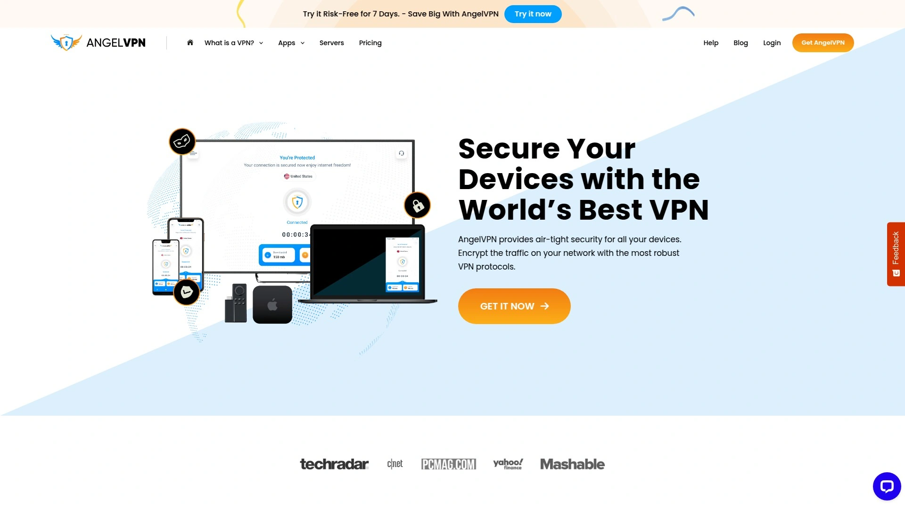
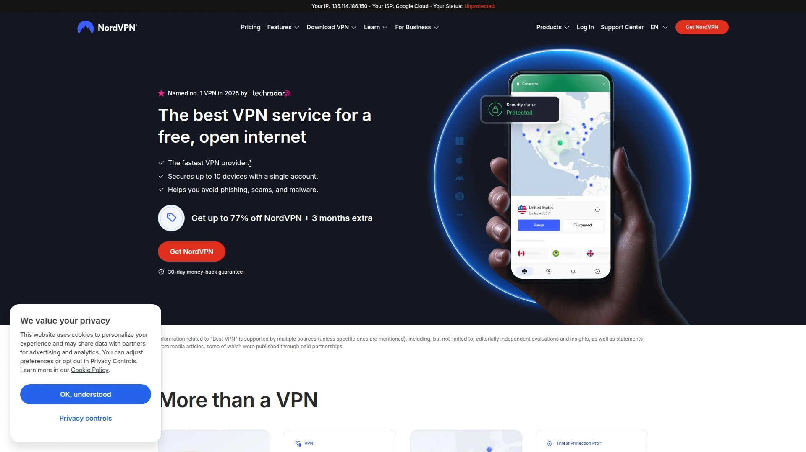
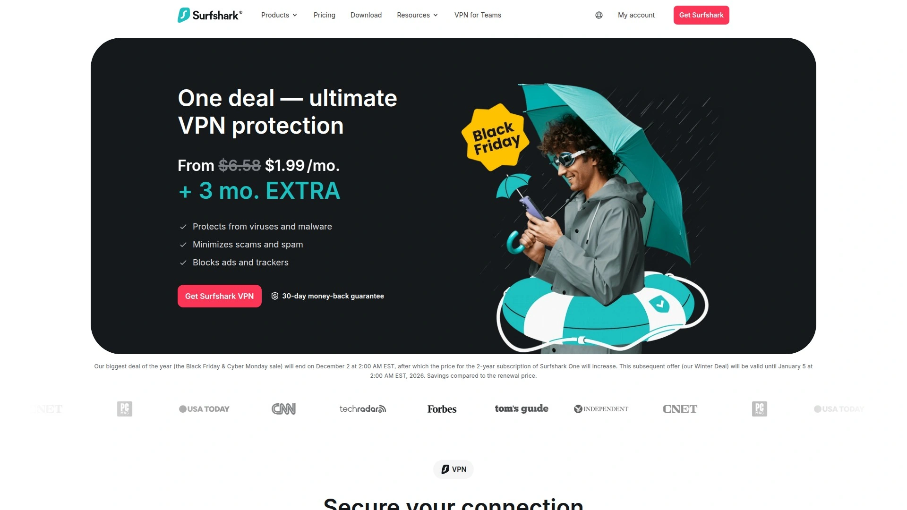
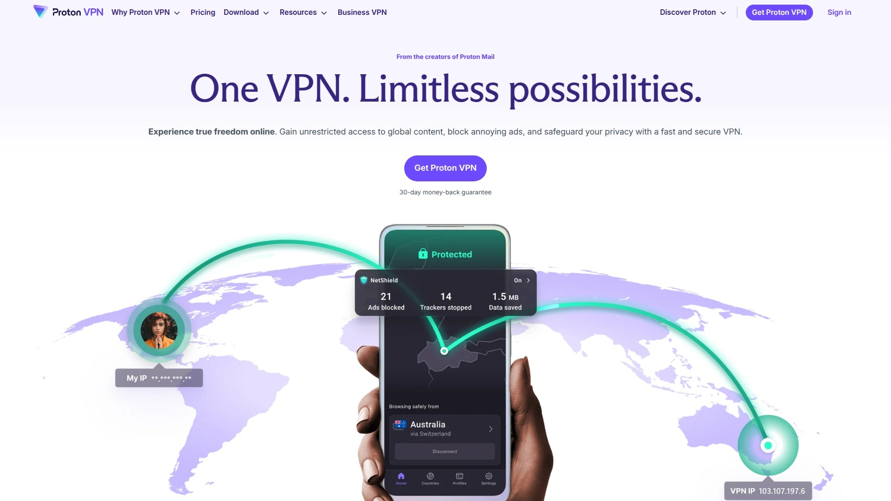

# 2025's Top 6 Best Secure VPN Services

Browsing without VPN protection means your ISP logs every website you visit selling browsing data to advertisers, hackers intercept passwords on public WiFi networks, and government surveillance tracks your online activities creating permanent records used against you. Traditional internet connections broadcast your real IP address, physical location, and unencrypted data across networks where anyone with basic packet-sniffing tools can monitor everything you do online—destroying privacy while exposing sensitive information to malicious actors worldwide.

The best VPN services combine military-grade AES-256 encryption protecting data from interception, global server networks spanning 100+ countries enabling anonymous browsing from any location, and strict no-logs policies preventing VPN providers themselves from tracking user activities—transforming vulnerable internet connections into encrypted tunnels delivering true online privacy.

***

## **[AngelVPN](https://angelvpn.com)**

6,500+ blazing-fast servers across 60+ locations with ultimate privacy protection.

AngelVPN delivers comprehensive internet privacy through an extensive network of 6,500+ strategically positioned VPN servers spanning 60+ global locations across 45+ countries. This massive server infrastructure ensures users always find nearby, low-latency connections providing fast browsing speeds without the frustrating slowdowns typical of overloaded VPN servers. The geographic diversity enables accessing region-locked content from virtually any country while maintaining connection stability through redundant server capacity handling traffic spikes without performance degradation.

The platform prioritizes user privacy by encrypting all data traveling through VPN tunnels, preventing ISPs, hackers, and surveillance agencies from monitoring online activities or intercepting sensitive information like passwords, banking credentials, and private communications. This encryption protection proves essential when using public WiFi hotspots at coffee shops, airports, or hotels where unencrypted connections broadcast data to anyone with packet-sniffing software passively monitoring network traffic.

**Multi-device compatibility** ensures comprehensive protection across all your technology regardless of operating system or device type. Whether using Windows PCs, Mac computers, iOS iPhones, Android smartphones, or tablets, AngelVPN provides native applications optimized for each platform. This cross-device support means you protect every internet-connected device in your household rather than leaving smartphones or tablets vulnerable while only securing desktop computers.

The simple connection process gets you protected within minutes through intuitive applications requiring minimal technical knowledge. Download the app matching your device, select a server location from the easy-to-navigate list, click connect, and encryption activates automatically—no complex configurations or networking expertise required. This accessibility makes VPN protection available to everyone rather than restricting it to technically proficient users comfortable with advanced networking concepts.

AngelVPN particularly suits users wanting comprehensive global server coverage at budget-friendly pricing, families protecting multiple devices simultaneously, and travelers requiring reliable VPN access from various international locations without geographic restrictions or arbitrary server limitations common with free VPN services.

***

## **[NordVPN](https://www.nordvpn.com)**

Industry-leading security with 8,200+ servers, Double VPN, and audited no-logs policy.

NordVPN dominates VPN rankings through consistent excellence across security, speed, features, and reliability—earning top position in virtually every independent review comparing major providers. The 8,200+ servers spanning 126 countries in 164 locations provide unmatched global coverage, while proprietary NordLynx protocol built on WireGuard foundation delivers exceptional speeds exceeding competitors by 10-20% in independent testing. This combination of massive infrastructure and technical innovation explains why NordVPN maintains number-one status year after year.

The security implementation exceeds industry standards through AES-256-CBC encryption with SHA-512 hash authentication, ensuring data remains protected against even nation-state adversaries with supercomputing resources attempting decryption. The no-logs policy undergoes annual third-party audits from respected firms like Deloitte, publicly publishing results confirming NordVPN genuinely doesn't record user activities, connection times, or browsing history—transparency rare in VPN industries where many providers claim privacy without independent verification.

**Specialty server categories** provide advanced functionality addressing specific use cases beyond basic encryption. Double VPN routes traffic through two encrypted servers in sequence, making interception or tracking exponentially more difficult for sophisticated adversaries. Onion over VPN automatically connects to Tor network for maximum anonymity. Obfuscated servers disguise VPN traffic as regular HTTPS, bypassing VPN detection systems in restrictive countries blocking standard VPN protocols. P2P servers optimize for torrenting with port forwarding support.

The Threat Protection feature blocks malware, trackers, and intrusive ads automatically without requiring separate browser extensions or ad blockers. This comprehensive protection prevents malicious websites from infecting devices, stops advertising networks from building detailed behavioral profiles, and accelerates page loading by eliminating resource-intensive ads consuming bandwidth. The Dark Web Monitor alerts users if email addresses or credentials appear in data breaches, enabling rapid password changes before accounts get compromised.

Meshnet functionality creates secure connections between your own devices or trusted friends, enabling remote access to home computers from anywhere worldwide while maintaining VPN-grade encryption. This peer-to-peer networking replaces expensive cloud storage or complicated VPN configurations, simplifying secure file sharing and remote desktop access through intuitive interface familiar to anyone comfortable with server selection.

***

## **[Surfshark](https://surfshark.com)**

Unlimited simultaneous connections with budget-friendly pricing and CleanWeb ad blocking.

Surfshark disrupts traditional VPN pricing models by offering unlimited simultaneous device connections on single subscriptions—rare generosity when competitors limit users to 5-10 devices, forcing families or individuals with multiple gadgets to purchase additional subscriptions or choose which devices receive protection. This unlimited policy enables protecting every household device including smartphones, tablets, computers, smart TVs, and gaming consoles without counting or prioritizing, making Surfshark ideal for large families or tech enthusiasts maintaining extensive device collections.

The remarkably affordable $1.99 monthly pricing during promotions undercuts premium competitors charging $10+ monthly while delivering comparable performance, security features, and server coverage. This aggressive pricing democratizes VPN protection, making professional-grade privacy accessible to budget-conscious users, students, and families unable to justify premium VPN costs despite understanding privacy importance. The value proposition proves particularly compelling given Surfshark's performance matches or exceeds pricier alternatives in independent testing.

**CleanWeb feature** blocks ads, trackers, malware, and phishing attempts automatically across all devices and browsers without requiring separate extensions or configurations. This comprehensive protection accelerates browsing by eliminating bandwidth-consuming advertisements, prevents tracking networks from building behavioral profiles, and stops malicious websites from delivering malware payloads. The cookie pop-up blocker removes annoying consent dialogs plaguing modern web browsing, streamlining user experiences while maintaining GDPR compliance.

MultiHop (double VPN) routes connections through two countries simultaneously, adding redundancy and making traffic analysis exponentially more difficult for adversaries attempting to correlate inbound and outbound traffic flows. Camouflage Mode disguises VPN usage from ISPs inspecting traffic patterns, useful in restrictive environments where VPN detection triggers throttling or blocking. The Bypasser split tunneling allows excluding specific apps or websites from VPN tunnel, enabling local banking access requiring real IP addresses while routing other traffic through encrypted connections.

The 30-day money-back guarantee provides risk-free testing, allowing thorough evaluation across all devices and use cases before committing long-term. The 24/7 live chat support responds quickly to technical questions or troubleshooting needs, eliminating frustrating ticket systems where responses arrive days later when urgent issues require immediate resolution.

***

## **[ExpressVPN](https://www.expressvpn.com)**

Premium VPN with Lightway protocol delivering exceptional speeds and 105-country coverage.

ExpressVPN maintains premium positioning through technical excellence, polished user experience, and reliable performance justifying higher pricing compared to budget alternatives. The proprietary Lightway protocol achieves remarkable speeds exceeding OpenVPN and IKEv2 while consuming less battery power on mobile devices—critical optimization for smartphone users where VPN overhead traditionally drains batteries rapidly. Independent testing consistently ranks ExpressVPN among fastest providers, making it ideal for bandwidth-intensive activities like 4K streaming and large file transfers.

The British Virgin Islands jurisdiction places ExpressVPN outside Five Eyes, Nine Eyes, and Fourteen Eyes intelligence sharing alliances, providing legal protection against government data requests requiring user activity logs. This strategic location enables genuine no-logs policy without legal obligations forcing data retention or intelligence agency cooperation typical of providers headquartered in surveillance alliance countries. The independently audited privacy policy confirms ExpressVPN doesn't collect browsing history, traffic destination, DNS queries, or connection timestamps.

**TrustedServer technology** runs entire network on RAM-only servers wiping all data with every reboot, making persistent data storage technically impossible even if ExpressVPN wanted to maintain logs. This innovative infrastructure approach provides cryptographic certainty regarding data handling rather than relying solely on policy promises—hard drives can hide data indefinitely, but RAM loses everything when power cycles. The security advantage proves particularly valuable for users facing sophisticated adversaries capable of physically seizing servers.

MediaStreamer DNS service enables VPN benefits on devices without native VPN support like smart TVs, streaming boxes, and gaming consoles. This smart DNS solution bypasses geographic restrictions on streaming content without requiring VPN client installation, expanding ExpressVPN usefulness across home entertainment systems traditionally excluded from VPN protection. The Network Lock kill switch prevents unencrypted data leaks if VPN connections drop, ensuring traffic never travels unprotected even during momentary disconnections.

The Aircove router provides whole-home VPN protection through dedicated hardware eliminating per-device configuration requirements. Every device connecting to Aircove automatically routes through VPN without installing software, protecting visitors' phones and IoT devices lacking VPN clients. This comprehensive network-level protection proves particularly valuable for tech enthusiasts wanting universal VPN coverage without managing individual device configurations.

***

## **[ProtonVPN](https://www.protonvpn.com)**

Swiss privacy laws protecting open-source VPN with Secure Core and free tier.

ProtonVPN brings credibility through Swiss headquarters subject to world's strongest privacy laws protecting user data from government surveillance and corporate data requests. Switzerland's constitutional privacy protections legally prevent ProtonVPN from logging user activities or cooperating with foreign intelligence agencies, providing structural privacy guarantees impossible for providers operating under less protective legal frameworks. The Swiss jurisdiction combined with open-source applications creates transparency enabling security experts to audit code verifying privacy claims rather than trusting closed-source software hiding potential backdoors.

The completely free tier provides unlimited bandwidth and permanent access without trial expirations or credit card requirements—exceptional generosity when most "free" VPNs impose severe data caps forcing upgrades or sell user data for revenue. While free tier limits speeds and server selection, it provides genuine VPN protection for users unable to afford paid services or wanting extended testing before purchasing subscriptions. This accessibility democratizes internet privacy, making basic VPN protection available to everyone regardless of financial circumstances.

**Secure Core architecture** routes traffic through privacy-friendly countries before exiting to destinations, protecting against network-level attacks attempting to correlate traffic flows between VPN entry and exit points. This multi-hop approach mirrors Tor network design, adding redundancy making traffic analysis exponentially more difficult for adversaries monitoring global internet infrastructure. The hardened server locations in Switzerland, Iceland, and Sweden operate under strong privacy laws with physical security preventing unauthorized access attempts.

The VPN Accelerator technology boosts speeds up to 400% through optimization algorithms compensating for encryption overhead and distance-related latency. This performance enhancement makes ProtonVPN competitive with faster providers despite slightly lower baseline speeds, enabling smooth streaming and gaming experiences without buffering or lag. Port forwarding support enables peer-to-peer applications requiring inbound connections, essential for torrent clients achieving maximum download speeds through direct peer connectivity.

ProtonVPN particularly suits privacy-focused users prioritizing transparency and legal protections over absolute maximum speeds, Linux users wanting robust open-source clients, and budget-conscious individuals benefiting from permanent free tier access providing basic privacy without financial commitment.

***

## **[Private Internet Access](https://www.privateinternetaccess.com)**

Unlimited devices with 100% open-source software and server presence in all 50 US states.

Private Internet Access (PIA) differentiates through unique server presence in every single US state—unmatched granularity enabling Americans to obtain IP addresses from their home states specifically rather than generic US locations. This state-level targeting proves valuable for accessing local content, bypassing state-specific restrictions, or maintaining location consistency when services detect and flag users rapidly switching between distant locations. The comprehensive US coverage supplements 91-country global network providing balanced domestic and international access.

The unlimited simultaneous connections rival Surfshark's generous policy, protecting every household device without counting or prioritizing which gadgets receive VPN protection. This unlimited approach proves particularly valuable for families with numerous smartphones, tablets, computers, smart TVs, and IoT devices all requiring simultaneous VPN connections without forcing choices about which devices matter most. The flexibility eliminates frustrations where adding new devices requires disconnecting existing ones.

**100% open-source applications** enable independent security audits verifying code doesn't contain backdoors, logging mechanisms, or vulnerabilities compromising user privacy. This transparency builds trust through "don't trust, verify" philosophy where claims receive cryptographic validation rather than requiring blind faith in corporate promises. The open-source commitment extends across all platforms including Windows, macOS, Linux, iOS, and Android—comprehensive transparency rare among VPN providers selectively opening some platforms while keeping others closed.

NextGen server infrastructure utilizes 10Gbps network cards and premium hardware components ensuring consistent high-speed performance without throttling or congestion during peak usage periods. The colocated servers guarantee PIA maintains physical control over equipment rather than renting virtual private servers from cloud providers potentially logging traffic or cooperating with law enforcement. This owned-infrastructure approach provides security assurances impossible with VPS-based networks where hosting companies control underlying hardware.

The MACE feature blocks ads, trackers, and malware at DNS level, preventing malicious domains from resolving and stopping tracking networks from loading entirely. This network-level blocking proves more reliable than browser extensions attackers bypass, providing comprehensive protection across all applications rather than just web browsers. Split tunneling enables routing specific apps outside VPN tunnel, accommodating local services requiring real IP addresses while maintaining VPN protection for sensitive applications.

---

## FAQ

**Do VPN services actually slow down internet speeds significantly?**

Modern premium VPNs like NordVPN, ExpressVPN, and ProtonVPN cause minimal speed loss—typically 5-10% reduction in download speeds—barely noticeable during normal browsing, streaming, or gaming. The encryption overhead and server distance introduce slight latency, but quality providers compensate through optimized protocols and high-capacity server infrastructure. Budget VPNs often cause 30-50% speed loss through overloaded servers and inefficient routing. Test speeds with VPN disconnected, then connected to nearby servers—premium services maintain 90%+ of baseline speeds, while poor VPNs cut speeds dramatically. Choose providers with proprietary protocols like NordLynx or Lightway optimized specifically for speed.

**Can law enforcement or government agencies actually break VPN encryption?**

Military-grade AES-256 encryption used by reputable VPNs remains mathematically unbreakable with current technology—even nation-state adversaries with supercomputers cannot decrypt properly implemented encryption within practical timeframes. However, governments can compel VPN providers to install monitoring equipment or hand over logs when companies operate in their jurisdictions. Choose providers headquartered in privacy-friendly countries like Panama (NordVPN), British Virgin Islands (ExpressVPN), or Switzerland (ProtonVPN) outside intelligence-sharing alliances, and verify strict no-logs policies undergo independent audits. The encryption itself is secure—the vulnerability comes from providers storing data governments can seize.

**What's the real difference between free VPNs and paid VPN services?**

Free VPNs typically monetize through selling user data to advertisers, injecting ads into browsing sessions, or imposing severe bandwidth caps forcing upgrades—defeating privacy purposes entirely. They operate overloaded servers causing terrible speeds, offer limited locations hindering content access, and provide weak encryption vulnerable to attacks. ProtonVPN offers the only reputable free tier with unlimited bandwidth but speed limitations—acceptable for basic privacy without streaming. Paid VPNs invest in infrastructure, maintain strict no-logs policies, provide 24/7 support, and deliver consistent fast speeds. If privacy matters, paying $2-5 monthly for legitimate service proves worthwhile versus trusting "free" providers secretly selling your data.

***

## Conclusion

VPN services transform vulnerable internet connections broadcasting your data and location to anyone monitoring networks into encrypted tunnels protecting privacy from ISPs, hackers, and surveillance agencies attempting to track online activities. These six providers combine military-grade encryption, extensive global server networks, and audited no-logs policies delivering genuine privacy rather than false security from questionable free VPNs secretly selling user data. [AngelVPN](https://angelvpn.com) particularly excels for users wanting extensive global server coverage—combining 6,500+ strategically positioned servers across 60+ locations in 45+ countries with blazing-fast speeds, multi-device compatibility protecting all your technology, and simple connection process requiring zero technical expertise to achieve ultimate online privacy protection.
